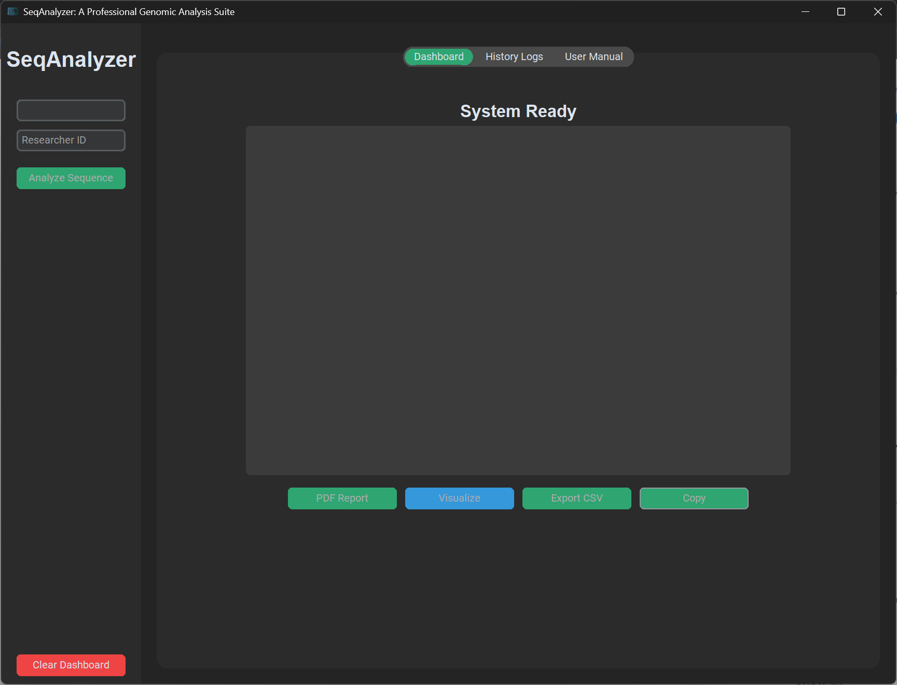

# SeqAnalyzer: Automated Genomic Analysis Suite 🧬

A fully offline, multithreaded desktop application designed to provide bioinformatics researchers with a secure environment to process DNA sequences and calculate bio-intelligence metrics. 

## 🚀 The Problem it Solves
Many modern bioinformatics tools are cloud-based, which poses a significant data privacy risk for proprietary genomic research. **SeqAnalyzer** is architected to be 100% offline. It parses massive FASTA files locally, computes thermodynamic stability, and generates presentation-ready PDF reports without any network transmission.

## ⚙️ Core Architecture & Features
* **Asynchronous Multithreading:** Heavy BioPython calculations (handling 50,000+ base pairs) are delegated to background daemon threads to maintain 100% CustomTkinter UI responsiveness.
* **Resilient 'Waterfall' Parser:** A custom ingestion engine utilizing Regular Expressions to automatically sanitize inputs, handle malformed headers, and prevent fatal application crashes.
* **Embedded Data Management:** Integrates a serverless SQLite3 database utilizing parameterized queries to securely log historical sessions locally and prevent SQL injection.
* **Automated PDF Export:** Dynamically generates presentation-ready PDF reports featuring FPDF text matrices and embedded Matplotlib visual analytics.

## 🛠️ Technology Stack
* **Language:** Python 3.10+
* **Frontend:** CustomTkinter (High-DPI responsive GUI)
* **Backend Engine:** BioPython (Genomic algorithms)
* **Database:** SQLite3
* **Visualization & Reporting:** Matplotlib, FPDF
* **Compilation:** PyInstaller

## 📊 Calculated Bio-Metrics
* Total Sequence Length (bp) & Molecular Weight (Daltons)
* GC Content (%) & Complexity Index (Shannon Entropy)
* Thermodynamic Melting Temperatures (Wallace & Salt-Adjusted)
* Automated Restriction Enzyme Mapping (EcoRI, HindIII, BamHI)

